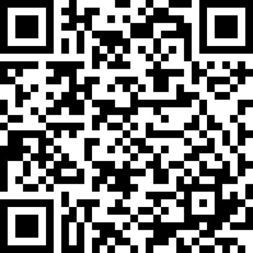

# Einführung in die   
Religionswissenschaft   
{: .r-fit-text}

### Aktuelle Themen in der Religionsforschung
{: .r-fit-text}

### 1. Was machen wir hier?

Wintersemester 2024/2025
Prof. Dr. Nathan Gibson

## Wer bin ich, wer seid Ihr?

## In the news and in history, religion is at the fore in 
- political extremism
- wars
- climate denying
- abuse of power

## And on personal level, religion is sometimes a factor in
- family tension
- fighting and abuse
- social isolation & conspiracy theories

## Religion has inspired
- incredible humanitarian deeds, caring for the marginalized
- great literature, art, music
- philosophical & scientific advancements

## And on the personal level, it can be a factor in
- building community
- life events & celebrations
- spiritual help & social support in crisis
- purpose & direction in life
- psychological well-being

<!-- We’re not here to try to decide whether religion is good or bad. I don’t think we can even answer that question in a binary way. But we do want to try to understand whether, and in what ways, religion is more than the sum of its parts. There are many parts, and there is a great diversity of “wholes.” -->

## Parts:
- social communities
- rituals and practices
- scriptures
- holy places and holy objects

## We observe dynamics of:
- leadership, power, gender
- social inclusion & exclusion
- oral & written communication
- physicality & embodiedness

## Diversity of "wholes"
- belief in one God, many gods, universal spirit, or no god
- different ideas about the source of truth or guidance, whether from scripture as divine revelation, from personal enlightenment, etc.
- religions that don't consider themselves religions, or that claim to embrace all religions
- different kinds of roots in particular languages & cultures
- overall different or even conflicting ideas about what a religion is and what it means for a person to follow or belong to a religion
... which leads us to the question, how can we define religion for the sake of studying it? Is there even such a category that encompasses this whole variety of things we call "religion"?

## Individual experience with religion

<!-- Each of us has our own experience of religion, and that is maybe not a small factor in why you're here. Maybe you're concerned about the danger religion is to society, to politics, to the climate, even to friends and family. Maybe for you religious people are weirdos that are oddly fascinating. Maybe religion has played a big role in your life, and you'd like to understand yourself better. Maybe, like me, you consider yourself a believer. Maybe you don't, but you consider yourself spiritual and you'd like to gain from the spiritual aspects of religion. -->

{: style="width: 700px"}

<https://partici.fi/92022824>

## Questions Religionswissenschaft can't answer

<!-- Comparison: why something rather than nothing, meaning of love, justice & fairness (not lawyer) -->

Religionswissenschaft:
- How did a belief originate? _but not_ Is there good reason to believe that?
- What is the significance of this community ritual? _but not_ Do people experience something supernatural in this ritual?
- How is this passage of scripture used to justify power relations? _but not_ How should this scripture be correctly interpreted?

## Lehrplan

## Ihre Ziele