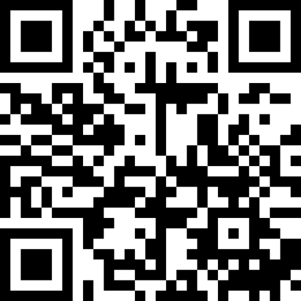

# Einführung in die Religionswissenschaft

### Aktuelle Themen in der Religionsforschung
{: .r-fit-text}

### 3. Was gilt als religiöses Ritual?

Wintersemester 2024/2025
Prof. Dr. Nathan Gibson

## Anmerkungen

Projekt

## 📈 Rückblick

Letztes Lernziel: Verschiedene Definitionen von Religion unterscheiden können, was sie umfassen und wofür sie nützlich sein können.

## 📈 Rückblick: Kriterien

1. Nicht zu breit, nicht zu eng
2. Nicht zu künstlich
3. Für unterschiedliche Kontexte in der Geschichte und Kultur geeignet
4. Für die Forschung operationalisierbar

## 📈 Rückblick: Definitionen

- substanzialistisch (Merkmale) vs. funktionalistisch (Leistungen)
- Durkheim: System, das Heilige, Gemeinschaft
- Geertz: Symbolsystem, Stimmungen & Motivationen, Aura von Faktizität
- Bourdieu: System, natürlich-übernatürliche Struktur, Auferlegung einer hierarchischen Denkweise

## Heutiges Lernziel

Rituale auf drei Ebenen (Formen, Funktionen, Bedeutungen) anhand von Beispielen schildern können.

## Poll

<https://ars.particify.de/p/92022824/series/3-Ritual>

{: style="width: 500px"}

## Welche Charakteristika haben Rituale?

## Definitions

- ritual as
  - theoretical concept vs
  - "a catchall term for a diverse set of cultural forms and practices, such as worship, baptism, parades, coronations, and festivals" (Stephenson 2022)

## Definitions

- Victor Turner: 
  - "ein wirkmächtiges Moment, das der Existenz durch die notwendige Vermischung operativer und auslegender Aspekte, die anderen Dimensionen angehören, Bedeutung gibt. (in Bromberger 2003, 293)
  - Compared to ceremony: "Ritual is transformative, ceremony confirmatory." (in Stephenson 2022)

## Definitions

- Ronald Grimes: “embodied, condensed, and prescribed enactment.” (The Craft of Ritual Studies (New York: Oxford University Press, 2014), 195 in Stephenson 2022)

## Lektüre (Bromberger): 3 Ebene

- 3 Ebene: Formen, Funktionen, Bedeutung

## Lektüre (Bromberger): Funktion

- Ritual insgesamt (nach Durkheim): "die Kontinuität kollektiven Bewusstseins zu sichern" und "sich selbst und anderen zu versichern, dass man zur selben Gruppe gehört" (1990, 1994)

## Lektüre (Bromberger): Funktion

Bei Fußball:
- Nur eine Ablenkung? Opium des Folks?
- Wunden heilen, Protest
- nicht zu vereinfachen

## Lektüre (Bromberger): Bedeutung

- Hierarchien
- Erfolg, Auftritt und Wettkampf unter Gleichen
- gewonnener Status (nicht von Geburt)
- Teamarbeit und Solidarität ("You'll never walk alone")
- Favorites nach sozialen Affinitäten

## Lektüre (Bromberger): Fußball-Religion Vergleich

Charakteristiken von Ritualen
1. Bruch mit der alltäglichen Routine
2. Spezieller Raum-Zeit-Bezug
3. zyklisch wiederkehrender Ablaufsplan mit Worten/Gesten/Gegenständen und transzendente Ziele

## Lektüre (Bromberger): Fußball-Religion Vergleich

Charakteristiken von Ritualen
`4. symbolische Konfiguration
`5. Anti-Struktur (umgestellte Hierarchien)
`6. moralisch verpflichtete Teilnahme

Bedeutungsvolle Diskrepanzen suchen (S. 294)

## Reflexion: Was gehört der Religion aber fehlt dem Fußball?

Was würde _dir_ fehlen, wenn du nur fußballmäßige Ritualen hättest?

## Reflexion: Was gehört der Religion aber fehlt dem Fußball?
- transzendente Glauben?
- Exegese (Bedeutungsmuster), "eher tut als sagt"
- woher wir kommen, wohin wir gehen?

## Diskussion in Kleingruppen

Wie würdest du die Bedeutung von deinem Lieblingsritual beschreiben?

## Vorschau

Wie bilden sich religiöse Gruppen und Autoritäten?